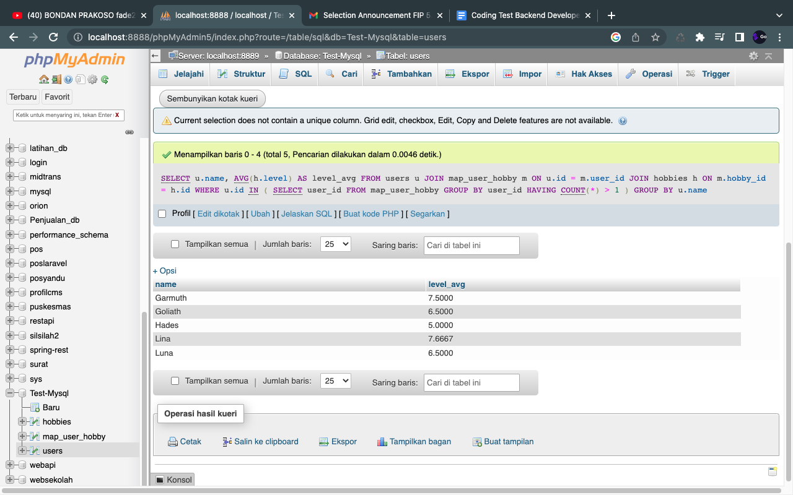

## Email
Nama : Ihya Natik Wibowo
Email : ihyanatikwibowo@gmail.com

## Cara Menjalankan Code
1. git clone https://github.com/Yunji45/latihan_query.git
2. Simpan folder dalam htdocs
3. Open Folder di Code Editor favorit anda
4. Pilih salah satu file ,kemudian debug/run code tersebut pada code editor anda
5. Atau , buka chrome dan ketik localhost:port_anda/folder_anda/pilih_file.php
6. Selamat Mencoba

## Cara menjalankan SQL Query
1. git clone https://github.com/Yunji45/latihan_query.git
2. Simpan Folder dalam htdocs
3. Import Database sql yang ada pada Folder mysql-query/Test-Mysql.sql kedalam PHPMyadmin
4. Jalankan perintah query yang ada pada Folder mysql-query/Query.txt
5. Selamat Mencoba

## Berikut Beberapa Hasil Screenshoot Program Tersebut

